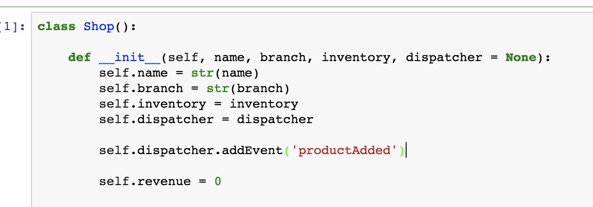
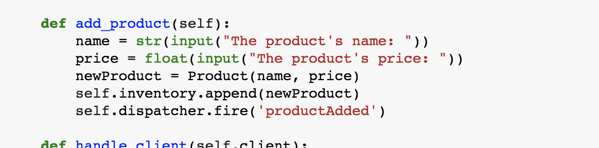
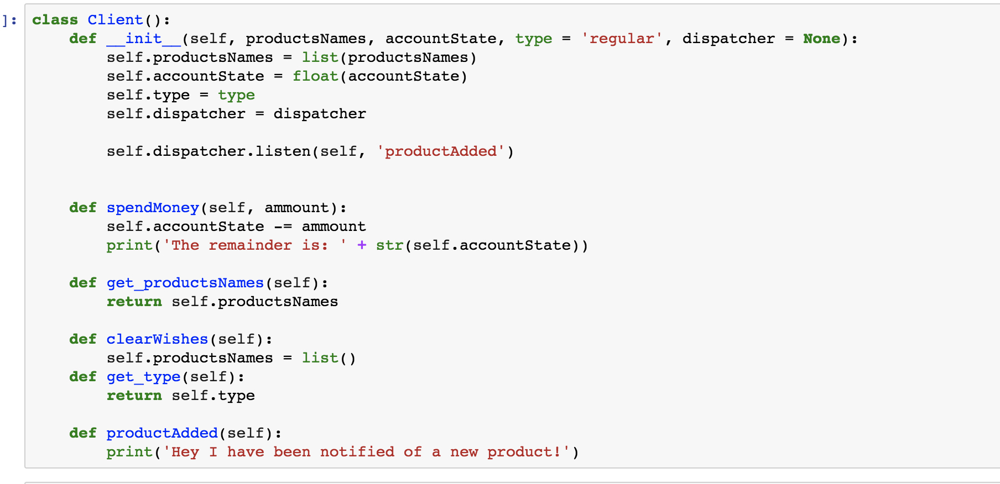

# Dispatcher

Klasa eventDispatcher to jest klasa ‘globalna’
niezalezna od Sklepu i Klienta
. Ma on atrybuty eventów i listenerów
oraz funkcje listen oraz fire. Najlepiej to zobaczyc na przykladzie,
ktory jest na dole.

1. tworze klienta czyli siebie (`me`) i daje sobie jako jeden argument obiekt dispatcher bym mogl sie do niego odwolywac wewnatrz obiektu
2. towrze `random` sklep ktory rowniez ma dostep do dispatchera. 
3. Potem robie cos takiego: 

Wewnatrz konstruktora sklepu ‘rejestruje’ event `self.dispatcher.addEvent('productAdded')`

Wywoluje ten event podczas dodawania produktu.

 
Wewntrz `me` (czyli kliena)
tworzę fukncję odpowiadającą eventowi.

To by było na tyle. Można to zobaczyć na jupyter notebook ;))

# Connector

In this part I just have my love from first database connection. How lovely. 
